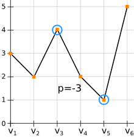
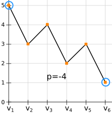
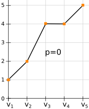

## The Goal:
A finance company is carrying out a study on the worst stock investments and would like to acquire a program to do so. The program must be able to analyze a chronological series of stock values in order to show the largest loss that it is possible to make by buying a share at a given time <code>t0</code> and by selling it at a later date <code>t1</code>. The loss will be expressed as the difference in value between <code>t0</code> and <code>t1</code>. If there is no loss, the loss will be worth `0`.

## Game Input:
### Input:

**Line 1:** the number `n` of stock values available.

**Line 2:** the stock values arranged in order, from the date of their introduction on the stock market <code>v1</code> until the last known value <code>vn</code>. The values are integers.

### Output:
The maximal loss `p`, expressed negatively if there is a loss, otherwise `0`.

### Constraints:
0 < `n` < 100000

0 < `v` < 231

### Examples:
#### 1:

##### Input:
	6
	3 2 4 2 1 5

##### Output:
	-3

#### 2:

##### Input:
	6
	5 3 4 2 3 1

##### Output:
	-4

#### 3:

##### Input:
	5
	1 2 4 4 5

##### Output:
	0

Link: https://www.codingame.com/ide/puzzle/stock-exchange-losses